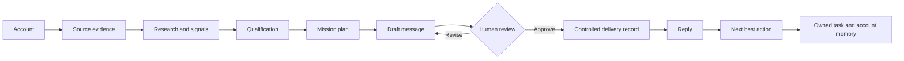

<h1 align="center">Navo</h1>

<p align="center">
  <strong>Turn account evidence into qualified opportunities, reviewed outreach, and owned next actions.</strong>
</p>

<p align="center">
  <a href="docs/PROJECT_STORY.zh-CN.md">中文项目说明</a> ·
  <a href="docs/DEMO_SCRIPT.md">Demo script</a> ·
  <a href="ARCHITECTURE.md">Architecture</a> ·
  <a href="docs/TECHNICAL_REFERENCE.md">Technical reference</a>
</p>

<p align="center">
  
</p>

<p align="center">
  <sub><em>One operating path from account evidence to the next commercial decision.</em></sub>
</p>

---

## Navo in one workflow

Navo is an account-intelligence and outbound-orchestration workspace for industrial B2B teams.

It starts with a target account, gathers source-backed evidence, separates facts from inference,
qualifies the opportunity, prepares a message for human review, and turns the reply into an owned
next action. The workspace keeps that operating loop visible from the first account review to the
next owned action.

```text
Accounts → Signals / Evidence → Research → Qualification → Contacts
→ Mission / Play → Message / Sequence → Replies → Next Best Action
```

Model output is structured, evidence is traceable, workflow state is durable, and external action
stops at a human checkpoint.

---

## Product and system decisions

The product is organized around one operator journey, with each layer assigned a clear
responsibility.

- **Product scope** — centers the primary experience on one operator loop with a clear beginning,
  decision points, and outcome.
- **Workflow architecture** — defined which steps belong to deterministic code, which decisions
  can use a model, and where execution must stop for review.
- **Evidence model** — separated source facts, external signals, qualification, recommendations,
  and human decisions so each claim has a visible origin.
- **Execution controls** — enforces iteration, account, continuation, idempotency, and
  outbound-action limits.
- **Validation coverage** — combines deterministic tests, browser coverage, a real-provider smoke
  path, and regression cases for entity consistency and evidence grounding.
- **Interface system** — keeps account, mission, approval, inbox, and analytics work consistent
  across one dense workspace.

I led the product definition, system planning, task decomposition, acceptance criteria, and
trade-off decisions across product, workflow, data, model integration, and validation.

---

## A look inside

| Account intelligence | Mission workbench |
| --- | --- |
|  |  |
| Source evidence and qualification stay beside the account. | A natural-language objective becomes a bounded, inspectable plan. |

| Human checkpoint | Reply loop |
| --- | --- |
|  |  |
| Proposed outreach is editable before approval and read-only after the decision. | A reply becomes a classified conversation, one next action, and one owned task. |

| Current workspace analytics |
| --- |
|  |
| Current query-backed values show conversion, qualification mix, and source performance. |

---

## How the loop holds together



The model proposes bounded structured decisions. Code owns linear scheduling, state transitions,
identity, persisted facts, limits, and postconditions. The reviewer owns the external-action
boundary.

---

## What works today

| Area | Current behavior |
| --- | --- |
| Account intelligence | Source evidence, signals, research, contacts, qualification, memory |
| Missions | Structured planning, bounded execution, continuation, pause/resume/cancel |
| Message review | Edit, request changes, approve, reject, recorded read-only state |
| Reply handling | Classification, summary, commitments, linked next action and task |
| Analytics | Current conversion, qualification mix, source performance |
| Reliability | Durable state, idempotency, immutable attempt history, deterministic fallback |
| Provider path | Deterministic mock mode plus workspace-scoped DeepSeek and OpenAI-compatible connections |

---

## Quick start

Requirements: Node.js, pnpm, Docker.

```bash
git clone https://github.com/shawliu998/Navo.git
cd Navo
pnpm run bootstrap
pnpm run dev:mock
```

Open `http://localhost:3100`, choose **DACH industrial outreach**, and follow the prepared demo
path. `dev:mock` uses deterministic local fixtures and does not require an API key.

To run a Mission with a real model:

1. Start the normal runtime with `pnpm dev`.
2. Open **Settings → AI runtime**.
3. Choose **DeepSeek** or **OpenAI-compatible**, then enter the base URL, model, and API key.
4. Save the configuration and run **Test connection**. The key is encrypted before storage and is
   never returned to the browser.
5. Create a Mission. Web planning and worker execution now resolve the connected provider for the
   active workspace; Mock remains the fallback when no connection is active.

`pnpm run bootstrap` generates the local credential-encryption key and `pnpm run doctor` verifies
the install. `pnpm smoke:ai` runs one paid, end-to-end opportunity Mission with the tested workspace
connection and prints only non-secret acceptance evidence. For the full environment reference, see
[technical reference](docs/TECHNICAL_REFERENCE.md).

---

## Verification

| Check | Result |
| --- | --- |
| Lint | 7/7 workspace tasks passed |
| Typecheck | 7/7 workspace tasks passed |
| Tests | 192 passed; 13 configured integration tests skipped |
| Live provider smoke | DeepSeek discovery → outreach continuation completed with both plans in `AI` mode, no fallback, and one `DRAFT` |
| Product E2E | 15/15 Playwright scenarios passed |
| Focused UI checks | Inbox and Analytics passed with zero console errors or warnings |
| Core workspace QA | Account, Mission, Approval, Inbox, and Analytics flows verified |

The most useful review path is the [3–5 minute demo](docs/DEMO_SCRIPT.md). Validation commands,
runtime contracts, and environment details are in the
[technical reference](docs/TECHNICAL_REFERENCE.md).

---

## Repository map

```text
apps/web        Next.js product workspace
apps/worker     Mission and reply execution
packages/agents Structured model adapter and agent contracts
packages/domain Business rules and workflow types
packages/db     PostgreSQL schema and queries
packages/workflows Research, signals, qualification, and drafting
docs            Demo, product story, and technical reference
artifacts       Product screenshots and packaged release material
```
