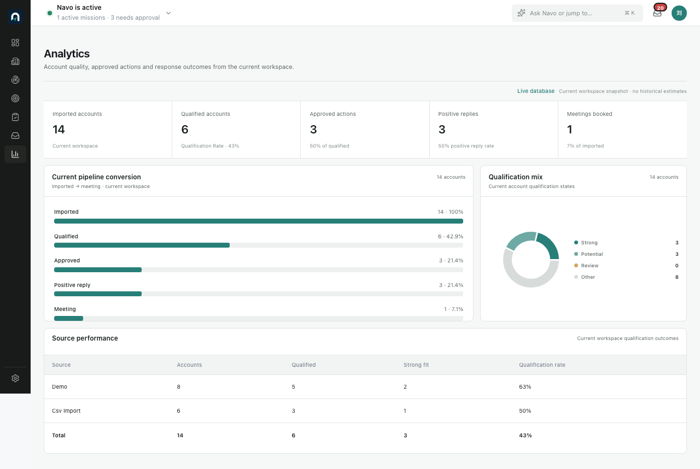
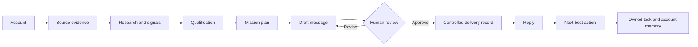

<h1 align="center">Navo</h1>

<p align="center">
  <strong>Turn account evidence into qualified opportunities, reviewed outreach, and owned next actions.</strong>
</p>

<p align="center">
  <a href="docs/PROJECT_STORY.zh-CN.md">Project story (ZH)</a> ·
  <a href="docs/DEMO_SCRIPT.md">Demo script</a> ·
  <a href="docs/PORTFOLIO_EVALUATION.md">Evaluation</a> ·
  <a href="ARCHITECTURE.md">Architecture</a> ·
  <a href="docs/TECHNICAL_REFERENCE.md">Technical reference</a>
</p>

<p align="center">
  
</p>

<p align="center">
  <sub><em>One operating path from account evidence to the next commercial decision.</em></sub>
</p>

---

## What is this, really?

Navo is an account-intelligence and outbound-orchestration workspace for industrial B2B teams.

It starts with a target account, gathers source-backed evidence, separates facts from inference,
qualifies the opportunity, prepares a message for human review, and turns the reply into an owned
next action. The interface is built around that operating loop—not around a chatbot.

```text
Accounts → Signals / Evidence → Research → Qualification → Contacts
→ Mission / Play → Message / Sequence → Replies → Next Best Action
```

In practice, Navo feels like a compact sales operations workspace. Underneath, it is a bounded
execution system: model output is structured, evidence is traceable, workflow state is durable,
and external action stops at a human checkpoint.

---

## What I designed

The main work was deciding how the system should behave before deciding how many features it
should have.

- **Product framing** — narrowed the product from a generic “AI sales platform” to one operator
  loop with a clear beginning, decision points, and outcome.
- **Workflow architecture** — defined which steps belong to deterministic code, which decisions
  can use a model, and where execution must stop for review.
- **Evidence model** — separated source facts, external signals, qualification, recommendations,
  and human decisions so each claim has a visible origin.
- **Failure boundaries** — added iteration, account, continuation, idempotency, and outbound-action
  limits instead of treating a successful happy path as sufficient.
- **Evaluation strategy** — designed deterministic tests, browser coverage, a real-provider smoke
  path, and regression cases around entity drift and unsupported narration.
- **Product interface** — adapted mature account, mission, approval, inbox, and analytics patterns
  into one dense workspace without turning infrastructure into the product.

I led the product definition, system planning, task decomposition, acceptance criteria, and
trade-off decisions. Coding assistants were used as implementation and review tools inside that
plan; repository facts, working behavior, and tests remained the source of truth.

---

## A look inside

| Account intelligence | Mission workbench |
| --- | --- |
|  |  |
| Source evidence and qualification stay beside the account. | A natural-language objective becomes a bounded, inspectable plan. |

| Human checkpoint | Reply loop |
| --- | --- |
|  |  |
| Proposed outreach is editable before approval and read-only after the decision. | A reply becomes a classified conversation, one next action, and one owned task. |

| Current workspace analytics |
| --- |
|  |
| Only current query-backed values are shown; synthetic trends and decorative filters were removed. |

---

## How the loop holds together



The model proposes bounded structured decisions. Code owns linear scheduling, state transitions,
identity, persisted facts, limits, and postconditions. The reviewer owns the external-action
boundary.

---

## What works today

| Area | Current behavior |
| --- | --- |
| Account intelligence | Source evidence, signals, research, contacts, qualification, memory |
| Missions | Structured planning, bounded execution, continuation, pause/resume/cancel |
| Message review | Edit, request changes, approve, reject, recorded read-only state |
| Reply handling | Classification, summary, commitments, linked next action and task |
| Analytics | Current conversion, qualification mix, source performance |
| Reliability | Durable state, idempotency, immutable attempt history, deterministic fallback |
| Provider path | Deterministic mock mode plus a DeepSeek structured-output smoke path |

This repository does not claim real outbound email, production CRM mutation, arbitrary code
execution, or production-grade security. Those are deliberate boundaries, not hidden gaps.

---

## Quick start

Requirements: Node.js, pnpm, Docker.

```bash
git clone https://github.com/shawliu998/Navo.git
cd Navo
pnpm run bootstrap
pnpm run dev:mock
```

Open `http://localhost:3100`, choose **DACH industrial outreach**, and follow the prepared demo
path. `dev:mock` uses deterministic local fixtures and does not require an API key.

For the full environment and provider configuration, see the
[technical reference](docs/TECHNICAL_REFERENCE.md).

---

## Verification

| Check | Result |
| --- | --- |
| Lint | 7/7 workspace tasks passed |
| Typecheck | 7/7 workspace tasks passed |
| Tests | 198 passed, including 13 PostgreSQL integration tests |
| Product E2E | 15/15 Playwright scenarios passed |
| Focused UI checks | Inbox and Analytics passed with zero console errors or warnings |
| Final cross-screen QA | No P0/P1/P2 blockers found across Account, Mission, Approval, Inbox, and Analytics |

The most useful review path is the
[3–5 minute demo](docs/DEMO_SCRIPT.md). The longer reasoning and test record lives in the
[portfolio evaluation](docs/PORTFOLIO_EVALUATION.md).

---

## Repository map

```text
apps/web        Next.js product workspace
apps/worker     Mission and reply execution
packages/agents Structured model adapter and agent contracts
packages/domain Business rules and workflow types
packages/db     PostgreSQL schema and queries
packages/workflows Research, signals, qualification, and drafting
docs            Demo, evaluation, and technical reference
artifacts       Recruiter-facing screenshots and packaged portfolio
```

---

## What it is not

- Not a chat interface with sales screens attached.
- Not an autonomous sender that bypasses review.
- Not a generic CRM replacement.
- Not an agent observability or infrastructure console.
- Not a claim that every visible capability is production-ready.

What it is: a concrete study in turning uncertain model output into observable, bounded, and
testable business behavior.
